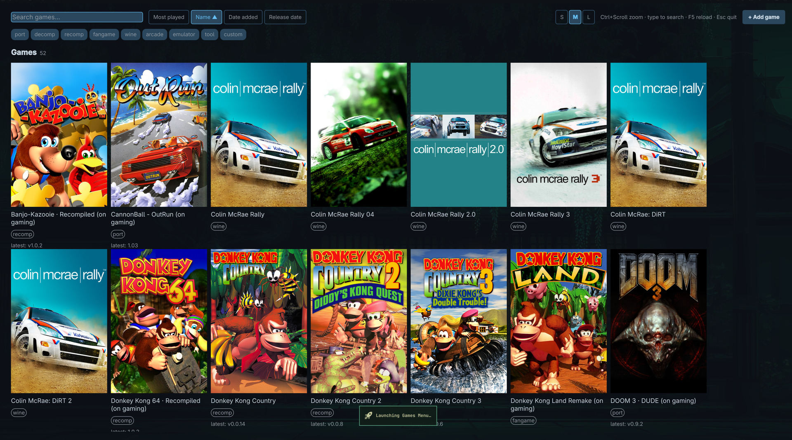

# omarchy-games-menu



A Steam-like fullscreen game launcher for the PC ports, recompilations, fangames,
Wine games and emulators installed by
[distrobox-gaming](https://github.com/akitaonrails/distrobox-gaming), built for
omarchy/Hyprland desktops.

Two halves:

- **`ogm`** — a Rust CLI that owns all logic: scanning desktop entries, a curated
  catalog, GitHub release checks, SteamGridDB cover/metadata downloads, launch
  tracking, and persistence. Fully unit tested (`cargo test`).
- **`qml/`** — a [QuickShell](https://quickshell.outfoxxed.me/) overlay (QML) that
  renders the grid. It watches the state file `ogm` writes and calls back into
  the CLI for every action.

## Install

From the AUR (Arch Linux):

```sh
yay -S omarchy-games-menu-bin   # prebuilt binary (recommended)
yay -S omarchy-games-menu       # build from source
```

From a checkout:

```sh
./install.sh        # cargo build --release, symlinks into ~/.local/bin
ogm scan            # build ~/.local/share/ogm/state.json
ogm refresh         # fetch latest GitHub releases + cover art
games-menu          # open the overlay
```

Suggested Hyprland bind (add to your hyprland config yourself):

```
bind = SUPER, G, exec, games-menu
```

## Configuration

`~/.config/ogm/config.toml`:

```toml
sgdb_api_key = "..."           # https://www.steamgriddb.com/profile/preferences/api
# github_token = "..."         # optional; raises the 60 req/h anonymous limit
refresh_interval_hours = 3     # min interval between GitHub re-checks
# catalog_dirs = ["/extra/fragments"]   # additional catalog fragment dirs
```

Cover art comes from SteamGridDB (free API key). Without a key everything still
works; cards fall back to themed placeholders/icons.

## Using the overlay

- **Click** a card to launch the game; the overlay dismisses itself.
- The grid is grouped into labeled sections — **Games** (ports, decomps, recomps,
  fangames, Wine, arcade), **Emulators**, **Tools** — never mixed; sorting applies
  within each section, and category chips/search narrow the sections down.
- **Ctrl + scroll** zooms the cover size (persisted to `~/.config/ogm/prefs.json`).
- **Type anywhere** to filter instantly — no need to click the search field;
  **Backspace** edits the query.
- **Page Up / Page Down** scroll a page, **Home / End** jump to top/bottom.
- **F5** or **Ctrl+R** rescans installed games (`ogm scan`). A scan also runs
  automatically on every open, and the UI live-reloads whenever `state.json`
  changes (e.g. distrobox-gaming installing a new game).
- UI size follows the monitor's Hyprland output scale automatically (detected via
  `hyprctl monitors -j` for the screen the overlay appears on; falls back to 1.0
  off-Hyprland).
- Sort by **Most played** (frecency: play count weighted by recency), **Name**,
  **Date added**, or **Release date**; click the active sort to flip direction.
- Filter by category chips and the search field.
- **Right-click** a card for Play / Hide (Remove for custom games) / Copy exec.
- **+ Add game** opens a dialog (name, exec, category, optional GitHub repo and
  SteamGridDB search name).
- **Esc**, **Ctrl+Q**, the compositor's close-window bind (e.g. **Super+W**),
  or clicking the dimmed backdrop closes the overlay.

## CLI

```
ogm scan [--json]                       # reconcile desktop files + catalog -> state.json
ogm refresh [--force]                   # GitHub latest-release checks + SGDB covers
ogm launch <id>                         # spawn detached, record play_count/last_played
ogm add --name N --exec CMD [--category C] [--github owner/repo] [--sgdb-query Q]
ogm remove <id> | hide <id> | show <id>
ogm list [--json]
ogm doctor                              # paths, keys, catalog/fragment counts
```

## Files

```
~/.config/ogm/config.toml      # keys and settings
~/.config/ogm/games.json       # custom games + hidden ids (UI dialog writes via ogm)
~/.config/ogm/catalog.d/       # external catalog fragments (see below)
~/.config/ogm/prefs.json       # UI prefs (zoom, sort, filters) — owned by the QML UI
~/.local/share/ogm/state.json  # merged collection + update status (owned by ogm)
~/.cache/ogm/covers/           # downloaded cover art
```

## Discovery

`ogm scan` picks up a `.desktop` file from the applications dirs when either:

1. **It carries `X-OGM-Managed=true`** (primary mechanism, rendered by
   distrobox-gaming). Optional keys refine the entry:
   `X-OGM-Category` (port|decomp|recomp|fangame|wine|arcade|emulator|tool|custom,
   default `custom`), `X-OGM-GitHub` (owner/repo), `X-OGM-SGDBQuery`
   (SteamGridDB search name), `X-OGM-WebURL` (project page),
   `X-OGM-UpdateURL` (page polled for changes; falls back to WebURL),
   `X-OGM-UpdateRegex` (capture group 1 = version string; without a group the
   whole match). X-OGM values override catalog.d fragments and the
   bundled catalog for the same desktop file.
2. **Its file stem matches `desktop_globs` in config.toml** (legacy fallback,
   keeps working unchanged for unmigrated entries).

## Integration API (catalog.d)

External tools (e.g. distrobox-gaming's `ogm_catalog` role) drop TOML fragments
into `~/.config/ogm/catalog.d/`. `ogm scan` merges them over the bundled
catalog; a fragment entry with the same `desktop_id` (or `id`) overrides it:

```toml
[[game]]
id = "my-port"
desktop_id = "gaming-my-port"     # desktop file stem, without .desktop
category = "port"                 # port|decomp|recomp|fangame|wine|arcade|emulator|tool|custom
github = "owner/repo"             # optional, enables release checks
sgdb_query = "My Port"            # optional, enables SteamGridDB art/metadata
```

After changing fragments or desktop files, run `ogm scan` (idempotent). Then
`ogm refresh` picks up art and release info in the background.

## Development

```
cargo test                                  # unit + integration tests, no network
cargo clippy --workspace --all-targets -- -D warnings
```

Workspace layout: `crates/ogm-core` (pure domain logic: desktop parsing, catalog,
sort/filter, frecency, version compare, reconcile), `crates/ogm-store` (XDG
persistence, atomic writes), `crates/ogm-net` (GitHub + SteamGridDB clients
behind traits, fixture-tested parsers), `crates/ogm-cli` (the `ogm` binary).

Preview the QML against a fixture without touching real state:

```sh
mkdir -p /tmp/ogm-dev/ogm /tmp/ogm-dev-cfg
cp qml/dev/sample-state.json /tmp/ogm-dev/ogm/state.json
XDG_DATA_HOME=/tmp/ogm-dev XDG_CONFIG_HOME=/tmp/ogm-dev-cfg quickshell -p qml
```
